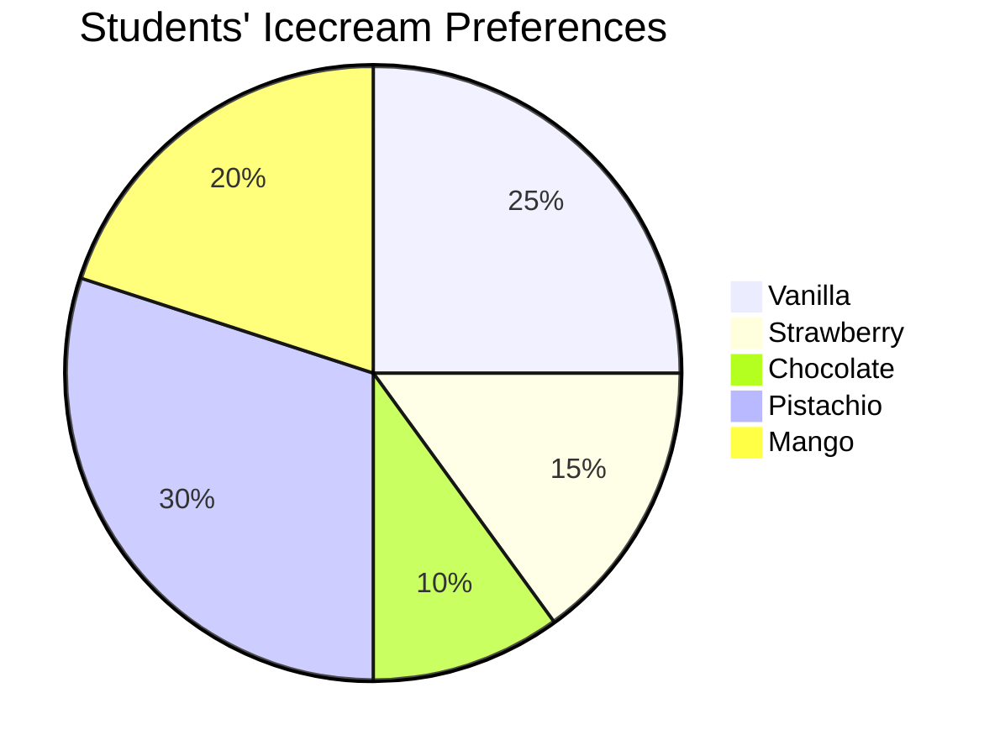

# Pie Chart
A ==circular graph== which is used to represent [[Data]].
### Characteristics
- Various observations of the data are represented by the sectors of the circle
- The total angle formed is 360°
- The whole circle represents the sum of the values of all the components
- The angle correpsonding to the particular observation component is given by

$$\text{Angle}=f_r\cdot{360}$$
### How to construct a pie chart
1. Find the central angle for each component using the formula previously given
2. Draw a circle of any radius
3. Draw a horizontal radius
4. Starting with the horizontal radius, draw a radii making central angles corresponding to the values of the respective components

## Example
Table:

| Flavors    | % of Students that Prefer it | Measure of Central Angles       |
| ---------- | ---------------------------- | ------------------------------- |
| Vanilla    | 25%                          | $\frac{25}{100}\cdot{360}=90°$  |
| Strawberry | 15%                          | $\frac{15}{100}\cdot{360}=54°$  |
| Chocolate  | 10%                          | $\frac{10}{100}\cdot{360}=36°$  |
| Pistachio  | 30%                          | $\frac{30}{100}\cdot{360}=108°$ |
| Mango      | 20%                          | $\frac{20}{100}\cdot{360}=72°$  | 
Pie Chart:

